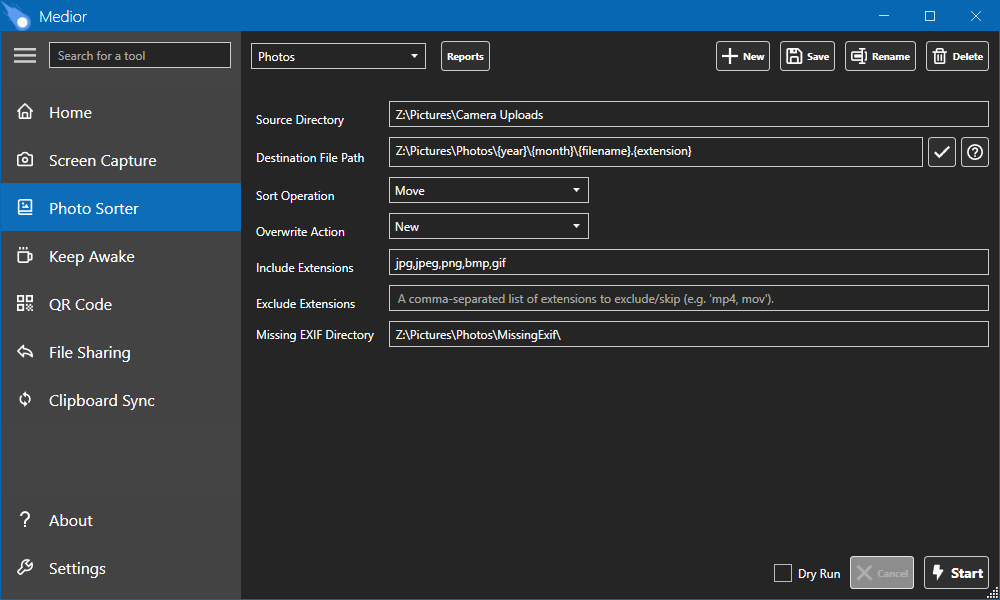

# Medior
A multimedia productivity toolkit for Windows.

Website: https://medior.jaredg.dev

## Description
Medior is a compilation of multimedia-related tools, compromised of a WPF desktop app and ASP.NET Core Blazor web app.

Current features include:
- Screen Capture
  - Capture both images and videos of your desktop
  - Screenshot editing through syncing with Snipping Tool
  - Instant sharing through Medior web app
  - QR code generation for share links
- File Sharing
  - Upload and share any file type
  - Uses the same backend as screen capture sharing
- Photo Sorter
  - Sort photos and videos into folders, where destination paths can include variables taken from photo metadata (e.g. date taken)
- Keep Awake
  - Prevent your computer from going to sleep, either until a set time or until explicitly disabled, without having to adjust power settings
- QR Code
  - Generate QR codes for any URL
- Clipboard Sync
  - Sync the contents of your clipboard to another device via a share URL

The app includes public/private key generation that can be used for authentication and client-side encryption.  However, none of the current features are utilizing it.  More features may be added in the future that do.

## Building
Requires VS2022 to build.  Run the `/.build/Build.ps1` script, passing in the parameter for the server URL.  This server URL is the public address where the server will be hosted (e.g. https://medior.app).  After completion, the output will be in `/Medior.Web/Server/bin/publish`.  This is everything that's needed to host the server, including the desktop app, which will have the server URL pre-configured.

## Screenshots

